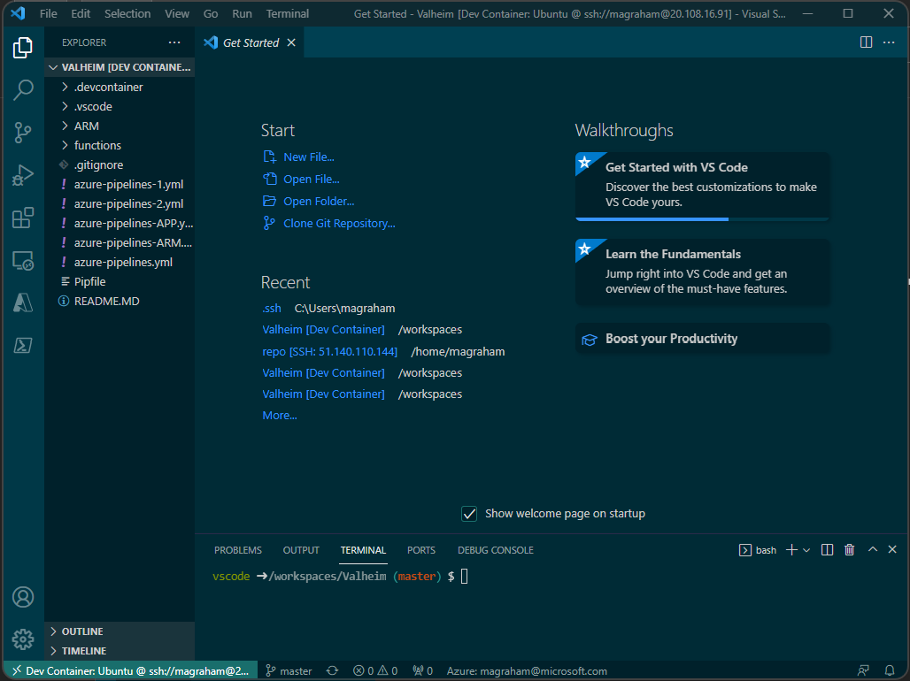

# Remote-DevContainers-Extras
Extras to show how DevContainers and Codespaces can be used for remote development with resources behind the firewall

# Options
1) Plain and simple use the SSH remote extension in VS Code. No code to show in here but worth highlighting as an option.
2) Codespace with a VPN into the network :smile:
3) SSH extension for VS code with a twist. Remote host is Linux with Docker installed. Run DevContainer on remote host. 


# Setup Walkthrough

The below steps will take a Linux VM that you want to use as a secure devcontainer host. It will setup docker on the host and then setup your developer desktop to connect to it for running devcontainers for development.

**Please note:** this doesn't cover the networking elements for connection between the developer desktop and devcontainer host. Key to note that the connection will require **SSH** connectivity.

## Prerequisites 

- Azure Subscription for hosting the devcontainer hosts.
  - Examples of hosts are Linux VM's or Dev/Test Labs for hosting Linux VM's...
- Internet access to download and install VS Code
- Remote hosts able to install docker
- VS Code Extensions able to be installed on the developer desktop and devcontainer host.
- Able to generate ssh keys 
- Access to setup ssh-agent on developer desktop

## devcontainer Host / Remote VM
- Creates a ssh key pair for connecting to the VM via VS Code 
  - From Windows: https://docs.microsoft.com/en-us/azure/virtual-machines/linux/ssh-from-windows 
  - From Linux/Mac: https://docs.microsoft.com/en-us/azure/virtual-machines/linux/mac-create-ssh-keys
  - Example:
    ```powershell
      ssh-keygen -m PEM -t rsa -b 4096
    ```
  
- Create a linux VM using the ssh key generated above.
- Install docker on the VM (https://docs.docker.com/engine/install/ubuntu/):  
  ```bash
    sudo apt-get update

    sudo apt-get install \
	    ca-certificates \
	    curl \
	    gnupg \
        lsb-release

    curl -fsSL https://download.docker.com/linux/ubuntu/gpg | sudo gpg --dearmor -o /usr/share/keyrings/docker-archive-keyring.gpg

    echo \
    "deb [arch=$(dpkg --print-architecture) signed-by=/usr/share/keyrings/docker-archive-keyring.gpg] https://download.docker.com/linux/ubuntu \
    $(lsb_release -cs) stable" | sudo tee /etc/apt/sources.list.d/docker.list > /dev/null

    sudo apt-get update
    sudo apt-get install docker-ce docker-ce-cli containerd.io 
    
  ```
- Make sure the user has the correct access to docker.
  ```bash
    sudo usermod -aG docker $USER
  ```

## Client
- Install VS Code (https://code.visualstudio.com/)
- Install the **Remote Development** extension:  
    
- Copy the private key into **.ssh** folder
- Setup ssh-agent in PowerShell
  ```powershell
    set-service ssh-agent -startuptype "Automatic"
    start-service ssh-agent
    ssh-add C:\Users\<user>\.ssh\<keyname>
  ```
  If you get errors connecting to the DevContainer (e.g. Crypto Errors) Upgrade the ssh agent. The following Powershell with find the latest zip file links:  
  ```powershell
    [Net.ServicePointManager]::SecurityProtocol = [Net.SecurityProtocolType]::Tls12
    $url = 'https://github.com/PowerShell/Win32-OpenSSH/releases/latest/'
    $request = [System.Net.WebRequest]::Create($url)
    $request.AllowAutoRedirect=$false
    $response=$request.GetResponse()
    $([String]$response.GetResponseHeader("Location")).Replace('tag','download') + '/OpenSSH-Win64.zip'  
    $([String]$response.GetResponseHeader("Location")).Replace('tag','download') + '/OpenSSH-Win32.zip'
  ```
- Optional: Install Docker Extension for visibility of the containers and images created  
    
  
## Process to connect to DevContainer
- Connect to the remote host using ssh (e.g. azureuser@1.2.45.6)  
  
- On the remote VM clone a repo (e.g. git clone ……)
- Run command : Remote-Containers: Open Folder in container
- Select the folder you want and VS Code will create/open the devcontainer on the remote VM.  
  

# Example VS Code Commands
- To edit / Open SSH configuration file:  
  - ```Remote-SSH: Open SSH Confiuratio File```
- To connect to remote host:  
  - ```Remote-SSH: Connnect to Host``` 
  - ```Remote-SSH: Connect Current Windows to Host```
- Reload VS Code Window if any config changes have been made (e.g. added new SSH Host in config file):  
  - ```Developer: Reload Window```
- Create new/replace devcontainer configuration files in a repo. :  
  - ```Remote-Containers: Add Developement Container Configuration Files...```
- To configure the remote container:  
  - ```Remote-Containers: Configure Container Features```
- Once on remote VM to open a devcontainer to can either run:  
  - ```Remote-Containers: Open Folder in Container```


# Links
- [Developing inside a Container](https://code.visualstudio.com/docs/remote/containers)
- [Create a developement container](https://code.visualstudio.com/docs/remote/create-dev-container)
- [devcontainer.json reference](https://code.visualstudio.com/docs/remote/devcontainerjson-reference)
- [Connect to remote Docker over SSH](https://code.visualstudio.com/docs/containers/ssh)
- [Generate a new SSH Key and adding it to the ssh-agent](https://docs.github.com/en/authentication/connecting-to-github-with-ssh/generating-a-new-ssh-key-and-adding-it-to-the-ssh-agent)
